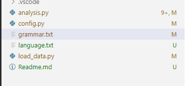

### Motivation/Aim

模拟一个SLR（1）语法分析器

### Content Description

#### 代码目录截图

#### 输入输出结果截图

#### 资源文件截图

### Ideas/Methods

思路如上图

###  重要的数据结构描述

数据结构以及运行过程截图如下

### 核心算法

* FIRST函数
* FOLLOW函数
* 求闭包
* 生成项目集
* 生成项目集规范族
* 生成ACTION、GOTO分析表
* 根据SLR（1）分析表分析语法

### Example

在Content Description部分已给出

### Problems occurred and related solutions

代码冗余，难以debug——拆分函数后analyse()函数简洁了许多

### Your feelings and comments

时间不够，学期课程比较多，期末之前搞完这个实属紧张。。应效仿其他几门课，最后一门作业留到期末完之后交。。^_^